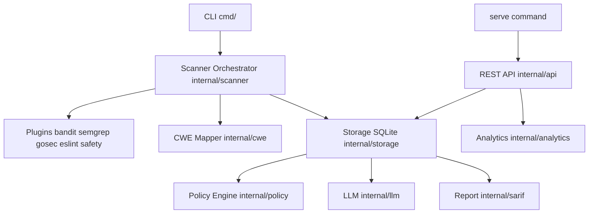

# Understanding the Coding Agent CLI Project

## What It Is

**Coding Agent CLI** is an **offline-first, AI-augmented security scanning platform** written in **Go**. It runs multiple SAST tools (Bandit, Semgrep, gosec, eslint-plugin-security, safety), normalizes results to a common format with CWE mapping, stores findings in SQLite, applies policy-as-code and waivers, optionally uses LLMs for remediation, and exposes results via CLI, reports (SARIF, HTML, JSON, etc.), and a REST API with analytics.

- **Module:** `github.com/coding-agent/cli` (Go 1.25)
- **Entry:** [main.go](../main.go) sets version and zerolog, then calls `cmd.Execute()`.

---

## High-Level Architecture

Data flow (from [developer-guide/architecture.md](developer-guide/architecture.md)): **Input** (path + scanners) → **Scanning** (plugins) → **Normalization** (CWE) → **Storage** (SQLite) → **Enrichment** (optional LLM) → **Policy evaluation** → **Reporting**.

---

## Directory Map

| Path | Role |
|------|------|
| **cmd/** | Cobra CLI: `root`, `scan`, `findings`, `report`, `policy`, `serve`, `migrate`, `import`, `export`. |
| **internal/scanner** | Orchestrator: runs plugins, aggregates and normalizes findings. |
| **internal/cwe** | Maps rule IDs to CWE; used during normalization. |
| **internal/storage** | SQLite DB, schema, migrations, persistence. |
| **internal/policy** | Policy parser, evaluator, matcher, waivers, compliance. |
| **internal/llm** | OpenAI, Anthropic, Ollama, cache, redaction, prompts. |
| **internal/sarif** | SARIF 2.1.0 and other report formats. |
| **internal/api** | Chi REST server, handlers, middleware, Swagger at `/api/docs`. |
| **internal/analytics** | Trends, MTTR, security score, hotspots (API only). |
| **internal/importer** / **exporter** | Finding import/export. |
| **plugins/** | One dir per scanner (bandit, semgrep, gosec, eslint, safety); each implements the scanner interface. |
| **api/** | OpenAPI spec only ([api/openapi.yaml](../api/openapi.yaml)). |
| **docs/** | User guide, developer guide, policy guide, release notes. |
| **examples/** | Sample policies, waivers, vulnerable sample, Ollama example. |
| **tests/integration/** | Integration tests; run with `go test -v -tags=integration ./tests/integration/...`. |
| **scripts/** | Build/release/benchmark (e.g. [scripts/build.bat](../scripts/build.bat)). |

---

## CLI Commands (from cmd/)

- **scan** – Run security scan on a path (optional: `--llm`, `--scanners`, `--policies`).
- **findings** – `list`, `show` (with optional AI remediation).
- **report** – `generate` (e.g. `--format html,sarif`).
- **policy** – `validate`, `list`, `test-patterns`.
- **serve** – Start HTTP server (default port 8080); API at `/api/v1/*`, Swagger at `/api/docs`. Analytics (trends, score, etc.) are only via API, not CLI.
- **migrate** – `status`, `up`, `down`, `backup`, `restore`.
- **import** / **export** – Findings import/export.

---

## Tech Stack (from go.mod and codebase)

- **CLI:** Cobra, Viper.
- **HTTP:** Chi, chi/cors.
- **DB:** SQLite via `modernc.org/sqlite`.
- **Logging:** zerolog.
- **Other:** google/uuid, gopkg.in/yaml.v3.
- **External:** Python (Bandit), Semgrep CLI; optional LLM: OpenAI, Anthropic, Ollama.

---

## How to Run and Use

- **Build:** `go build -o coding-agent-cli` (or use [scripts/build.bat](../scripts/build.bat) for multi-platform).
- **Scan:** `coding-agent-cli scan ./my-app` (optional `--llm`, `--scanners`, `--policies`).
- **Web/API:** `coding-agent-cli serve` → API at `http://localhost:8080`, Swagger at `http://localhost:8080/api/docs`.
- **Config:** Optional `config.yaml` (Viper); see [README.md](../README.md) and [user-guide/03-configuration.md](user-guide/03-configuration.md).
- **Tests:** See [developer-guide/testing.md](developer-guide/testing.md) for unit, integration, and phase-based test commands.

---

## Documentation Quick Links

- [README.md](../README.md) – Overview, quick start, config outline.
- [CONTRIBUTING.md](../CONTRIBUTING.md) – Setup, testing, integration tests, conventional commits.
- [developer-guide/architecture.md](developer-guide/architecture.md) – Architecture and data flow.
- [user-guide/](user-guide/) – Installation, configuration, scanning, findings, policies, reports, LLM, dashboard, API, CI/CD.
- [policy-guide/](policy-guide/) – Policy syntax, examples, waivers, compliance.

This document is a single reference to understand the whole project: purpose, layout, data flow, and how to build and run it.
